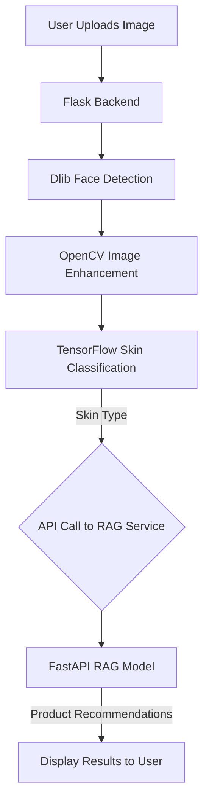

# Radiant Root: AI-Powered Skincare Advisor ✨

Tired of the endless trial and error with skincare products? **Radiant Root** is your personal AI skincare consultant! This project leverages deep learning to accurately identify your skin type (Oily, Dry, or Normal) from a simple photograph. Based on the analysis, it provides personalized product recommendations using a sophisticated Retrieval-Augmented Generation (RAG) model.

## 🚀 Features

* **📸 AI Skin Analysis:** Upload a photo, and our custom-trained TensorFlow model classifies your skin type with high accuracy.
* **🧠 Smart Recommendations:** Receive personalized product suggestions from our state-of-the-art RAG model, ensuring the advice is relevant and helpful.
* **🖼️ Advanced Image Enhancement:** Before analysis, your photo is automatically enhanced using OpenCV to improve clarity, contrast, and facial feature detection.
* **🌐 Interactive Web Interface:** A clean and simple user interface built with Flask.
* **🚀 Modern Architecture:** Built with a decoupled microservices approach, using **Flask** for the core computer vision tasks and a separate **FastAPI** service for the NLP-based recommendation engine.

---

## 🛠️ How It Works

The application follows a streamlined, multi-step process from image upload to product recommendation. The architecture is designed to be modular and scalable.




### 💻 Tech Stack

<table align="center">
  <tr>
    <td align="center"><strong>Backend</strong></td>
    <td align="center"><strong>Frontend</strong></td>
    <td align="center"><strong>Deployment</strong></td>
  </tr>
  <tr>
    <td align="center">
      <a href="https://www.python.org/" target="_blank"></a>
      <a href="https://flask.palletsprojects.com/" target="_blank"></a>
      <a href="https://fastapi.tiangolo.com/" target="_blank"></a>
      <a href="https://www.tensorflow.org/" target="_blank"></a>
      <a href="https://opencv.org/" target="_blank"></a>
    </td>
    <td align="center">
      <a href="https://developer.mozilla.org/en-US/docs/Web/HTML" target="_blank"></a>
      <a href="https://developer.mozilla.org/en-US/docs/Web/CSS" target="_blank"></a>
      <a href="https://developer.mozilla.org/en-US/docs/Web/JavaScript" target="_blank"></a>
    </td>
    <td align="center">
      <a href="https://render.com/" target="_blank"></a>
    </td>
  </tr>
</table>


<details>
<summary><strong>⚙️ Local Setup & Installation</strong></summary>

<br>


To run this project on your local machine, follow these steps:

### Prerequisites
* **Python 3.8+**
* **A C++ compiler** (required for `dlib` installation):
    * **Windows:** Install [Visual Studio Build Tools](https://visualstudio.microsoft.com/visual-cpp-build-tools/).
    * **macOS:** Run `xcode-select --install` in your terminal.
    * **Linux:** Run `sudo apt-get install build-essential` in your terminal.

### Installation

1.  **Clone the repository:**
    ```bash
    git clone https://github.com/RautRitesh/skin-care-advisor.git
    cd skin-care-advisor
    ```

2.  **Create and activate a virtual environment:**
    ```bash
    # Create the virtual environment
    python -m venv venv

    # Activate it (run the command for your OS)
    # On Windows:
    .\venv\Scripts\activate
    # On macOS/Linux:
    source venv/bin/activate
    ```

3.  **Install the required packages:**
    ```bash
    pip install -r requirements.txt
    ```
    *(If you don't have a `requirements.txt` file, create one with this content):*
    ```text
    flask
    tensorflow
    opencv-python
    dlib
    numpy
    pillow
    ```

4.  **Download Model Files:**
    * **Dlib Shape Predictor:** Download the `shape_predictor_68_face_landmarks.dat` file from [this link](http://dlib.net/files/shape_predictor_68_face_landmarks.dat.bz2). Unzip it and place the `.dat` file in the main project folder.
    * **Keras Model:** Make sure your `last_final_2.keras` file is also in the main project folder.

5.  **Run the Flask Application:**
    ```bash
    python app.py
    ```

6.  **View the App:** Open your web browser and go to `http://127.0.0.1:5000`.

</details>

---

<details>
<summary><strong>🤝 Contributing</strong></summary>
<br>

Contributions are welcome! If you'd like to improve this project, please feel free to fork the repository and submit a pull request.

1.  **Fork** the Project
2.  **Create** your Feature Branch (`git checkout -b feature/AmazingFeature`)
3.  **Commit** your Changes (`git commit -m 'Add some AmazingFeature'`)
4.  **Push** to the Branch (`git push origin feature/AmazingFeature`)
5.  **Open** a Pull Request

</details>

</details>
